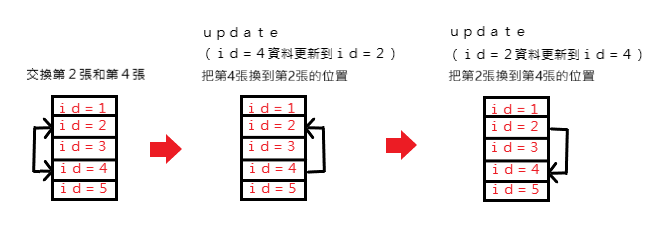

# 撲克牌遊戲—抽鬼牌
一款簡易、易上手的電腦遊戲，使用C#作為開發語言，以MSSQL管理資料，實作一個雙人互動抽鬼牌遊戲。

抽鬼牌遊戲畫面

## 刪除成對牌
使用LINQ將point陣列內的points做GroupBy並存入groupbyBResult，判斷groupbyBResult如果count()是偶數則將資料表所對應ID的資料刪除，如果count()是奇數張則將資料表所對應ID的資料刪除但是保留一張牌。

## 交換兩張牌

